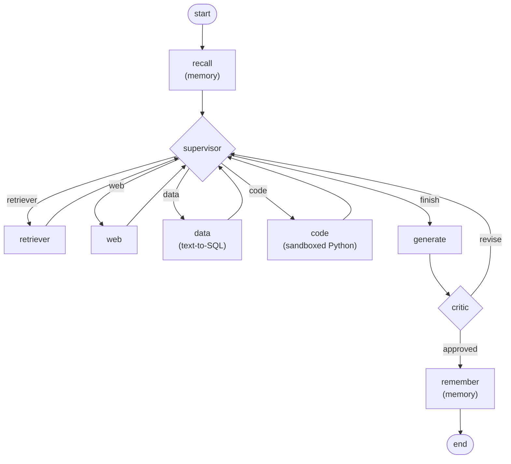

# Multi-Agent AI Analyst

A supervisor-led multi-agent system: a router delegates a question to document retrieval, web
search, text-to-SQL, and/or Python specialists, a critic verifies the drafted answer before it's
returned, and long-term memory lets follow-up questions build on earlier turns. Built for the
Multi-Agent AI Analyst capstone (Phases 1–5).

## Stack

- **LLM + embeddings**: Gemini (`gemini-flash-lite` for chat, `gemini-embedding` for embeddings),
  routed through an OpenAI-compatible proxy via `langchain-openai`
- **Vector store**: Qdrant, embedded (no signup) — one collection for documents, one for memory
- **Database**: SQLite (`data/company.db`), queried read-only via text-to-SQL
- **Web search**: Tavily (optional — skips gracefully without a key)
- **Observability**: Langfuse (optional — no-ops cleanly without keys)
- **Orchestration**: LangGraph
- **Backend API**: FastAPI (`api.py`), streaming the graph's steps + answer as newline-delimited
  JSON, deployed on Render — live at
  [multi-agent-ai-analyst-fhpo.onrender.com](https://multi-agent-ai-analyst-fhpo.onrender.com)
- **Frontend**: Next.js + Tailwind (`frontend/`), a custom chat UI with a live color-coded agent
  trace panel, deployed on Vercel — live at
  [multi-agent-ai-analyst-sigma.vercel.app](https://multi-agent-ai-analyst-sigma.vercel.app)
- *(local-only alternative)*: `app.py` is a Gradio `ChatInterface` for quick local testing without
  the Next.js frontend; it's no longer what's deployed on Render

## Architecture



A `recursion_limit` (15) on `graph.invoke()`/`graph.stream()` guarantees termination even if
routing misbehaves; a `MAX_REVISIONS` cap (2) in `route_after_critic` forces a finish if the critic
keeps rejecting.

## Setup

```bash
pip install -r requirements.txt
```

Create a `.env` in the project root:

```
GEMINI_API_KEY=your_key_here
TAVILY_API_KEY=your_key_here            # optional
LANGFUSE_PUBLIC_KEY=your_key_here       # optional
LANGFUSE_SECRET_KEY=your_key_here       # optional
LANGFUSE_HOST=https://cloud.langfuse.com  # optional
```

Build the sample database and vector store (both are gitignored, regenerate locally):

```bash
python seed_db.py
python ingest.py
```

## Running

```bash
python main.py "How many customers churned in 2024, and what does the FAQ say about why?"
python api.py                  # backend API on :8000 (what the Next.js frontend calls)
python app.py                  # local Gradio UI (standalone alternative, no separate frontend needed)
```

To run the Next.js frontend locally against the API:

```bash
cd frontend
npm install
npm run dev                    # http://localhost:3000, calls NEXT_PUBLIC_API_URL (.env.local)
```

## Deployment

**Backend** — live on Render: **https://multi-agent-ai-analyst-fhpo.onrender.com**

Deployed via `render.yaml` (Blueprint): build runs `pip install -r requirements.txt` then
regenerates the gitignored `data/company.db` and `qdrant_storage/` with `seed_db.py`/`ingest.py`;
start runs `python api.py`, a FastAPI app binding to `0.0.0.0` on Render's assigned `$PORT`
(`GET /api/health`, `POST /api/chat` streaming ND-JSON). The four secret keys (`GEMINI_API_KEY`,
`TAVILY_API_KEY`, `LANGFUSE_SECRET_KEY`, `LANGFUSE_PUBLIC_KEY`) are set as Render environment
variables, never committed. Render's free tier spins the service down after inactivity, so the
first request after a while can take ~30–60s to cold-start.

**Frontend** — live on Vercel: **https://multi-agent-ai-analyst-sigma.vercel.app**

Deployed from the `frontend/` subdirectory (Vercel's *Root Directory* project setting is set to
`frontend`; zero other config needed, Next.js is auto-detected). One environment variable is set in
the Vercel project: `NEXT_PUBLIC_API_URL` = the Render backend URL above. CORS on the backend is
open (`allow_origins=["*"]`) so the Vercel domain can call it directly.

## Evaluation results

`eval/harness.py` runs 10 questions spanning all 4 specialist types (3 retriever, 4 data, 2 code,
1 web) through the graph twice — once with the real critic, once with the critic stubbed to always
approve — and scores both with RAGAS (faithfulness, answer_relevancy, context_precision) and a
custom LLM-judge (1–5 vs. a reference answer).

| Condition | Avg LLM-judge | Faithfulness | Answer relevancy | Context precision |
|---|---|---|---|---|
| **With critic** | 5.00 / 5 | 0.725 | 0.950 | 1.000 |
| **Without critic** | 5.00 / 5 | 0.725 | 0.950 | 1.000 |

**Reading these honestly**: all 10/10 questions score 5/5 on the LLM-judge in both conditions, and
with-critic vs. without-critic now produce *identical* RAGAS scores — because on this benchmark the
critic never actually has anything to revise (every answer is already correct and fully evidenced on
the first pass), so the two graphs produce byte-identical answers. That's an honest property of this
10-question set, not a flaw in the critic: it's mostly atomic, single-agent questions. The critic's
real demonstrated value shows up on harder, multi-part questions — see error analysis #1, where the
critic is the one thing standing between a fabricated SQL literal and a wrong final answer. Earlier
runs of this same harness showed a lower, noisier faithfulness score (~0.5–0.67) and some RAGAS jobs
failing outright; that was `AnswerRelevancy`'s default multi-candidate sampling getting rejected by
the proxy, now fixed (see error analysis #4) — these numbers are from a clean run with zero job
failures.

## Error analysis

Four real failures found while building and testing this system, each with the fix applied.

### 1. Text-to-SQL agent hallucinated a fake column value

**Question**: "How many customers churned, and what does the FAQ say about why?"
**What went wrong**: `data_agent`'s LLM wrote a syntactically valid but semantically fabricated
query — `SELECT count(*), 'The FAQ states that customers churn due to...' FROM customers ...` —
inventing a string literal to answer the qualitative "why" half of the question, since SQL can't
actually answer that. The read-only guard let it through (it *is* a `SELECT`). The supervisor then
saw evidence for both halves of the question and finished without ever calling `retriever`, and
the critic approved the resulting answer, misattributing the fabricated claim to "the SQL result."
**Failure category**: SQL agent wrong + critic let a bad answer through.
**Fix**: tightened `data_agent`'s prompt to forbid inventing literals for data not in the schema,
and to answer only the part of the question SQL can actually support.

### 2. Supervisor infinite routing loop

**What went wrong**: after fix #1, the supervisor (`gemini-flash-lite`) kept re-selecting
`retriever` on every turn, even though its own prompt explicitly showed `Documents collected: 4`
and `retriever` already in the executed steps. It looped until `recursion_limit=15` raised a clean
`GraphRecursionError` instead of hanging forever — the safety net worked, but the routing itself
was broken.
**Failure category**: supervisor mis-routed.
**Fix**: rather than continuing to tune prompt wording, added a deterministic code-level guard in
`supervisor.py` — if the model re-picks a specialist that already ran, the code overrides the
choice to `finish`. The LLM proposes, the code enforces the invariant.

### 3. Follow-up question ("And last year?") not resolved using memory

**What went wrong**: the supervisor's `resolved_question` field (meant to rewrite context-dependent
follow-ups into standalone questions using recalled memory) returned the question unchanged. As a
result, `data_agent` received the bare, ambiguous "And last year?" with no context and produced an
unrelated, wrong query.
**Failure category**: supervisor/memory resolution failed.
**Fix**: rather than relying solely on the supervisor's rewrite, passed `state['memory']` directly
into `data_agent`'s and `code_agent`'s own prompts, so each specialist can resolve
context-dependent references itself even when the upstream rewrite doesn't happen. Verified fix:
the same follow-up now correctly resolves to "churned in 2023" and returns the right count (1).

### 4. Supervisor skipped straight to "finish" on a polluted memory recall

**Question**: "What is the sum of the first 100 positive integers?" (found while browser-testing the
new frontend, after the memory store had accumulated a few turns from earlier manual testing).
**What went wrong**: two compounding bugs. First, `is_first_call` was computed as
`len(state["steps"]) == 0`, which is never actually true in the memory-enabled graph, because
`recall_agent` already appends a `"memory(recall N turns)"` step before `supervisor` runs for the
first time. This silently disabled the `resolved_question` rewrite on every real run — confirmed by
re-running `test_memory.py`, which showed `resolved question used: And last year?` (never actually
rewritten), even though this was documented as fixed in error analysis #3. Second, the supervisor's
prompt labeled recalled memory "Relevant past Q&A turns" without qualification, so when the memory
store returned a near-duplicate or simply irrelevant past turn (Qdrant's cosine similarity search
has no relevance cutoff, and a small store returns its closest matches regardless of true relevance),
the model sometimes treated that recalled text as if it were evidence and picked `finish` without
ever calling a specialist — skipping `code` entirely and answering "the provided evidence does not
contain the information" instead of computing 5050.
**Failure category**: supervisor mis-routed + a dead code path silently defeating an earlier fix.
**Fix**: `is_first_call` now checks for a prior `"supervisor→"` step instead of an empty step list,
so it's actually true exactly once per run. The prompt was reworded to state explicitly that
recalled memory is only for resolving pronouns/references via `resolved_question` and is never
evidence for `finish`. And, mirroring the existing "already ran" guard, a new code-level invariant
was added: if the model tries to pick `finish` before any specialist has run, it's re-asked with
`finish` removed from the valid options entirely. Verified fix: the sum-of-100 question now correctly
routes to `code` and answers 5050; `test_memory.py`'s follow-up now genuinely rewrites to "How many
customers churned in 2023?" instead of passing the question through unchanged; a deliberately
unanswerable question still declines gracefully, but only after actually trying a specialist first.

## Submission checklist

- [x] Own free API keys (Gemini, Qdrant embedded, Tavily, Langfuse) — Gemini routed through an
      approved proxy per project owner's decision
- [x] Supervisor graph + 4 specialist agents + critic
- [x] Real SQLite database, text-to-SQL with a read-only `SELECT`-only guard
- [x] Code agent sandboxed in a separate process with a 5s timeout (hard-killed, not just abandoned)
- [x] Long-term memory recalls an earlier turn (see error analysis #3 for the fix that made this
      actually work)
- [x] Evaluation: RAGAS + LLM-judge over 10 questions, with vs. without critic, reported above
- [x] Langfuse tracing wired and authenticated (`LANGFUSE_PUBLIC_KEY`/`LANGFUSE_SECRET_KEY` verified
      via `client.auth_check()`)
- [x] Backend API (FastAPI) deployed on Render:
      [multi-agent-ai-analyst-fhpo.onrender.com](https://multi-agent-ai-analyst-fhpo.onrender.com)
- [x] Frontend (Next.js) deployed on Vercel:
      [multi-agent-ai-analyst-sigma.vercel.app](https://multi-agent-ai-analyst-sigma.vercel.app)
- [ ] Add your own screenshots: frontend live trace, Langfuse trace — not something I can capture
      on your behalf

## Known limitations

- The proxy key in use restricts model access to `gemini-flash-lite`/`gemini-embedding` only, so
  the supervisor and critic run on the same lite model as the specialists rather than a stronger
  model — the code-level routing guard (error analysis #2) exists specifically to compensate for
  this.
- Render's free tier spins the service down after inactivity; the first request after idle time can
  take ~30–60s to cold-start.
- `recall_agent`'s similarity search still has no relevance threshold — a small memory store can
  return its closest matches even when none are strongly related to the new question. This no longer
  causes wrong routing (see error analysis #4: the supervisor is now told explicitly that recalled
  memory isn't evidence, and can't reach `finish` without running a specialist first), but a
  similarity-score cutoff in `retrieve_past_turns` (`memory.py`) would still be a cleaner fix at the
  source if noisy recalls become a problem elsewhere (e.g. `resolved_question` rewrites).
